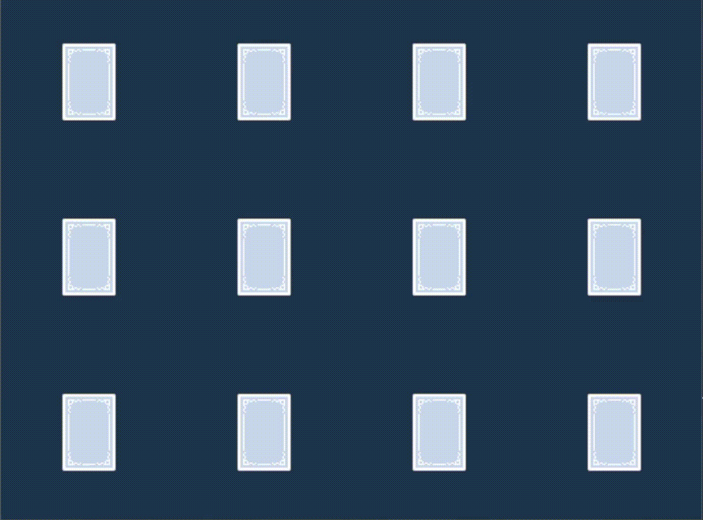

A toy game created to play around with the [ggez](https://github.com/ggez/ggez) framework for Rust. Uses assets from [Kenney](https://kenney.nl/assets/playing-cards-pack).

Incomplete, because at this time I'm too lazy to finish up the logic, but card-flipping and a static board of 4x3 cards are there, and that's what I'm interested in right now.

Run with `DEBUG=1` to show grid lines and mouse coordinates.
